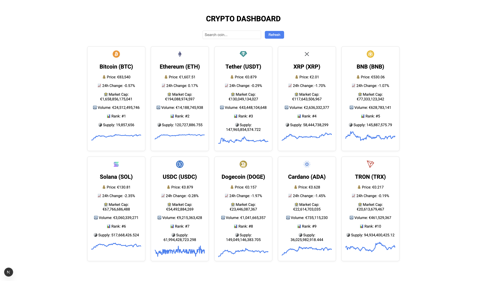

# 🪙 Crypto Dashboard

Responsive dashboard that displays live cryptocurrency market data using the CoinGecko API. Built with **Next.js**, **React**, and **Axios**.

## 📸 Preview

 <!-- You can add a screenshot here -->

## 🚀 Features

- 🔄 Live crypto prices for the top 10 coins
- 🔍 Real time search by name or symbol
- 📈 Mini chart showing 7 day price trends
- 🔁 Auto-refresh every 60 seconds + button refresh
- 📱 Simple and clean UI
- ✅ Built with components and clean project structure
- 🧪 Unit testing with Jest + React Testing Library

## 🛠️ Tech Stack

- [Next.js](https://nextjs.org/)
- [React](https://react.dev/)
- [Axios](https://axios-http.com/)
- [Chart.js](https://www.chartjs.org/)
- [CoinGecko API](https://www.coingecko.com/en/api)

## 🧑‍💻 Getting Started

```bash
# Clone the repo
git clone https://github.com/valm10/crypto-dashboard.git
cd crypto-dashboard

# Install dependencies
npm install

# Start the dev server
npm run dev
```
